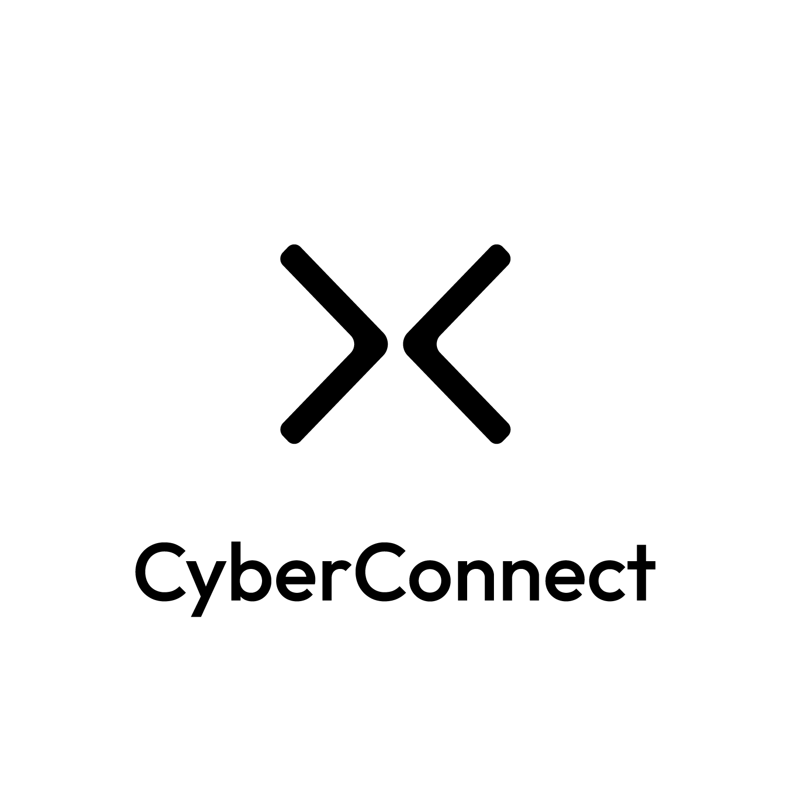

## Fanclub

This is a demo project integrated with [CyberConnect](https://cyberconnect.me/) where you can follow a specific address and mint an membership NFT by becoming of a "fan" of the address.
Date fetched from [cyberconnect API](https://api.cybertino.io/connect/graphiql).

## Features

This app includes two features:

### 1. Follow/unfollow

The app allows the current logged in user to follow/unfollow a specific address.

### 2. Mint a membership NFT

The app allows the user to mint a membership NFT (ERC1155 Token) as long as the user followed the specific address, and the user didn't have the same NFT.


## Getting Started

First, run the development server:

```bash
npm install
# then
npm run dev
```

Open [http://localhost:3000](http://localhost:3000) with your browser to see the result.

Meanwhile, we also need to run the local server for this app which you can clone from the [Fanclub-Server](https://github.com/BruceWangyq/Fanclub-Server).

After that, you can run the server:

```bash
npm install
# then
node index.js
```

Open [http://localhost:5000](http://localhost:5000) with your browser to see the result.


